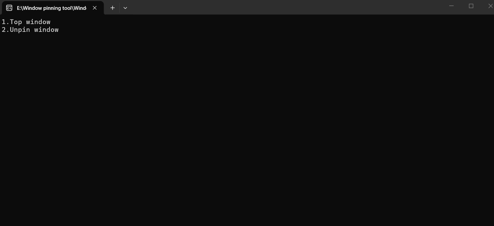

# Windows pinning tool
## 窗口置顶工具

**简洁、轻量、一键让任意窗口保持在屏幕最前端的 Windows 实用小工具。**
## ✨ 功能特性

- **一键置顶 / 取消置顶**：选中窗口即可切换置顶状态
- **全局热键**：支持快捷键快速操作，无需切换界面
- **极小体积**：无依赖、免安装、打开即用
- **兼容全 Windows**：Win10 / Win11 完美运行
- **无广告无后台**：纯本地工具，保护隐私

## 📌 适用场景

- 看视频、直播时置顶不被遮挡
- 写代码 / 文档时置顶参考窗口
- 聊天窗口、笔记窗口常驻前端
- 演示、教学时固定关键窗口

## 🧩 系统要求

- 系统：Windows 10 / Windows 11
- 架构：x86 /x64
- 权限：普通用户权限即可运行

## 📝 许可证

**本工具为免费开源小工具，仅供个人使用，禁止商用。**
